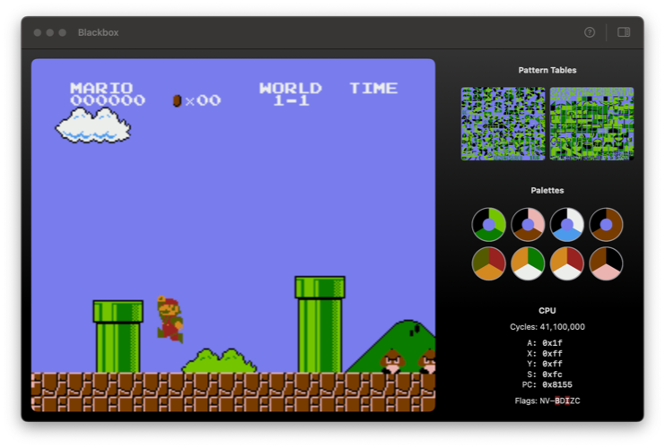
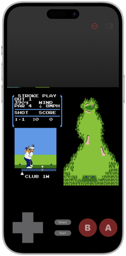
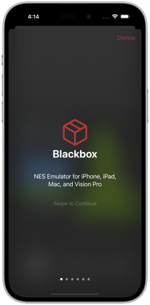
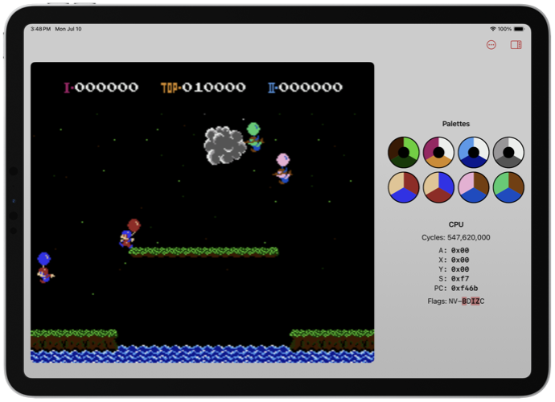
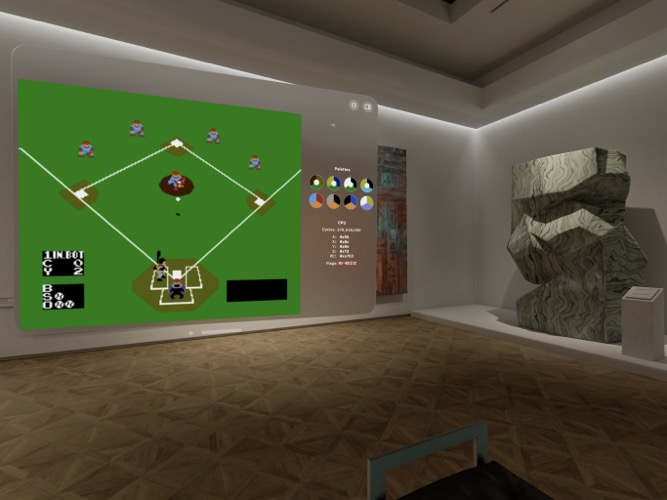

# Blackbox
### Nintendo Entertainment System (NES) emulator for Apple platforms

Blackbox is an NES emulator app for iOS, iPadOS, macOS, and visionOS.

It’s a work in progress by [Grady Haynes](mailto:grady@wordparts.com) and is freely available under the MIT license. Feedback and contributions are welcomed. It requires a minimum of iOS/iPadOS 16.4, macOS Ventura 13.3, or the visionOS 1.0 simulator. Building Blackbox requires Xcode 14. (visionOS support requires the Xcode 15 beta.)

Blackbox is a hobby project for experimentation and learning, but I’d be delighted for anyone to use it, learn from it, or reuse its code in another project.

It’s named for the classic [“black box” games](https://videogamegraders.com/nes-black-box-games-details/) released alongside and soon after the NES’s release in North America in 1985. 

  

  
  

  

  

## Technical Details
Blackbox uses the SwiftUI app lifecycle. It includes:
- Game controller and keyboard support leveraging the system [Game Controller framework](https://developer.apple.com/documentation/gamecontroller)
- An onscreen virtual touch controller [available as a Swift package](https://github.com/glhaynes/OnscreenController)
- A set of “accessories” providing realtime information on the emulated NES’s CPU state and the PPU’s palettes and pattern tables
- An onboarding/usage workflow
- Support for opening NES ROM files (iNES format), including a recents list

It’s built on top of `CoreBlackbox`, a module that provides the following:
- A Swift wrapper around the `m6502` CPU emulator from [floooh’s “chips” project](https://github.com/floooh/chips)
- Another 6502 emulator, “CPU6502”, written in Swift
  - Aside from cycle timing, this is an accurate emulator, including “illegal” instructions. It is not yet usable as the emulation core to play games, but addressing this is a top priority.
- Emulation of the NES’s Picture Processing Unit (PPU)
- (Very) basic mapper support
- Loading and parsing iNES files (ROMs)

More of the above components may be separated into their own Swift packages in the future. If you have suggestions for what would be particularly useful, please let me know.

## Playing NES games

Blackbox is *not* the best way to play NES games on these platforms, at least not currently. It isn’t compatible with most games and has no audio emulation. That said, I’ve had a great time playing through [Super Mario Bros.](https://en.wikipedia.org/wiki/Super_Mario_Bros.) several times during its development!

If your primary goal is playing NES games on Apple platforms, I’d suggest checking out [OpenEmu](https://openemu.org) for Mac, [Delta](https://github.com/rileytestut/Delta) for iOS, or [Provenance](https://github.com/Provenance-Emu/Provenance) for iOS and tvOS.

## Acknowledgements
This project relies heavily on some fantastic resources, most prominently those below. I’m grateful for their work.

- `m6502` from [floooh’s “chips” project](https://github.com/floooh/chips) is a well-crafted set of highly-accurate 8-bit chip emulators. The project’s 6502 emulator is used in this project and [this document](https://floooh.github.io/2019/12/13/cycle-stepped-6502.html) describing it was enlightening reading.
- Javidx9’s [NES Emulator From Scratch](https://www.youtube.com/playlist?list=PLrOv9FMX8xJHqMvSGB_9G9nZZ_4IgteYf) channel on YouTube was tremendously helpful, particularly when building the PPU emulation.
- The included “Sample ROM” is [`NES-ca65-example`](https://github.com/bbbradsmith/NES-ca65-example) by [Brad Smith](http://rainwarrior.ca/). Assembly source is available at the link.
- [RussianManSMWC](https://github.com/RussianManSMWC)’s [Donkey Kong NES disassembly](https://github.com/RussianManSMWC/Donkey-Kong-NES-Disassembly) saved hours of debugging time while getting the project’s components connected.
- [Toffer D. Brutechild](https://itstoffer.com) beta tested and gave valuable feedback, ideas, and encouragement. 
